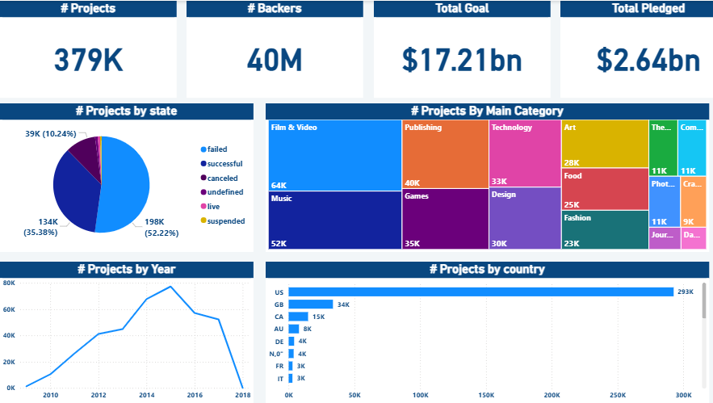

# 🎯 Kickstarter Data Analysis – Power BI Project

## 📌 Project Overview
This project focuses on analyzing Kickstarter campaign data to uncover patterns in project success rates, categories, and trends over time.  
The dashboard was created using **Power BI**, with data sourced from CSV files.

## 🧰 Tools & Techniques
- Power BI Desktop
- Power Query (M Language)
- DAX Measures
- Data Cleaning & Transformation
- Various Visualizations (Pie, Donut, Treemap, Line, Bar)
- Hierarchies & Filters
- Outlier Detection

## 🪄 Key Steps
- Import CSV files using Import Mode
- Append Queries & Merge Data
- Remove duplicates and keep the most recent records
- Filter & clean data, detect outliers
- Format columns/measures as Currency
- Create calculated columns & DAX measures
- Build interactive visuals and improve layout

## 📊 Dashboard Preview

## 📂 Project Files

Due to GitHub's file size limitations, the Power BI project file (.pbix) and dataset are hosted on Google Drive.  
You can access and download all the project files from the link below:

👉 [Download from Google Drive](https://drive.google.com/drive/folders/1vZqiSu_fr7FAQEdWf6d6dUQA8Gf85DS8?usp=sharing)

## 📂 Dataset
[Kaggle: Kickstarter Projects Dataset](https://www.kaggle.com/datasets/kemical/kickstarter-projects)

## 🧑‍💻 Author
Ahmed Mustafa Alazab

---

> 💡 This project was done as part of my data analytics practice using Power BI.
